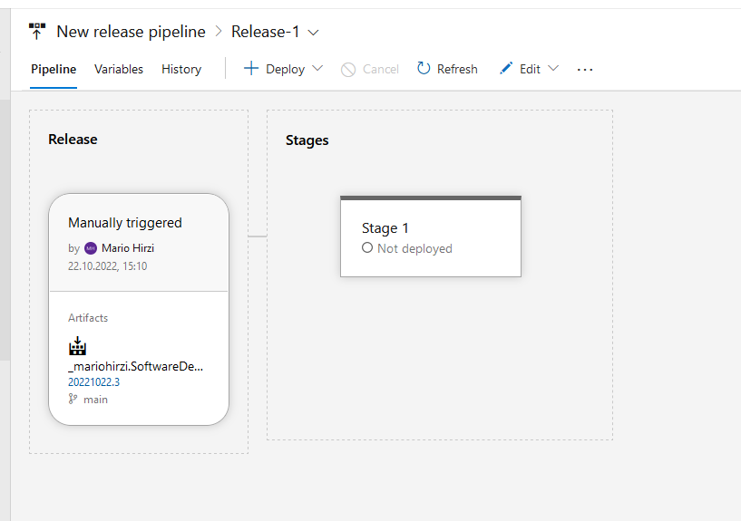
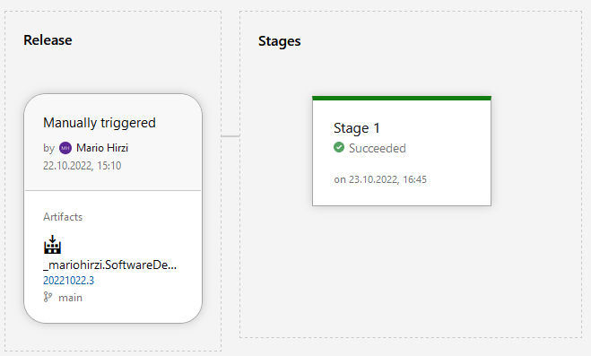

## Link
[Web App for development](http://web-app-name-01.azurewebsites.net/).

## Screenshots
Not deployed

deployed

Build and Deploy status

Release

## Release Ablauf:
1. Es wird eine neue Release-Pipeline erstellt
2. Danach wird das template ausgewählt (Delpoy a Node.js to Azure App Service)
3. In den Pre-deployment conditions wird auf Manual Only gestellt
4. Ein artifact wird hinzugefügt (die zuvor erstellte Pipline)
5. Azure subscription wird hinzugefügt
6. Der name des app services
7. Speichern und Create a release
8. Deploy

## Probleme
1. Weder mit Ubuntu noch mit Windows Server funktioniert die Webapp. Deployen funktioniert zwar, aber ruft man die Seite http://web-app-name-01.azurewebsites.net/ auf
bekommt man einen Application Error.
    Mit dem Diagnose and solve problems tool findet man diesen Fehler:
    npm ERR! enoent ENOENT: no such file or directory, open '/home/site/wwwroot/package.json'

2. Links zu den Azure Web-Apps (dev & production) sollen dafür zwei Releases erstellt werden oder ist der Pipline deploy dev und der Release production? Wenn
das so ist wie laufen die auf einem untschiedlichen Link, bekomm immer einen Fehler, wenn die Namen bei der Pipline und dem Release nicht übereinstimmen.
