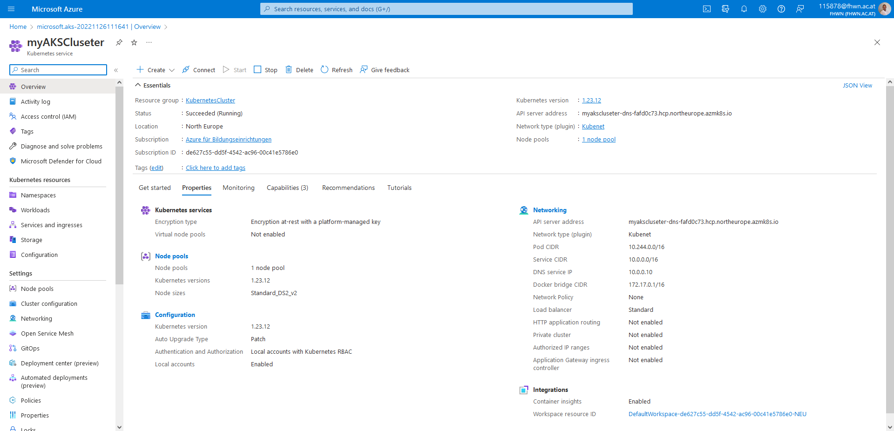
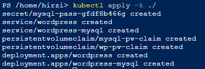
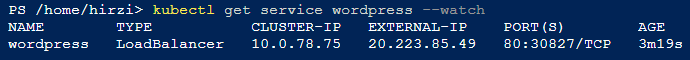
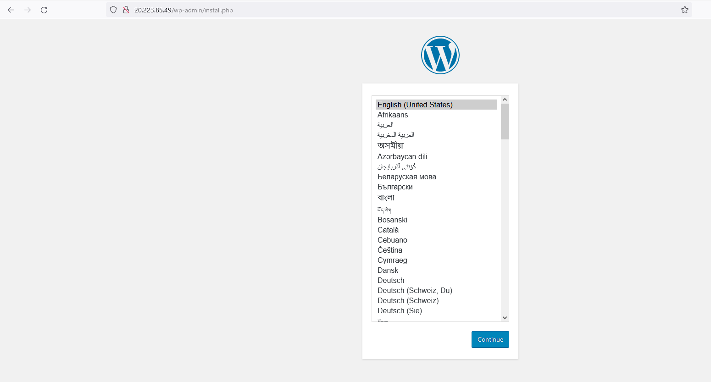

 ## Aufgabenstellung

- Aufestezen und Konfiguration eines AKS in Azure

- Konfiguration und deplyoment von Wordpress incl. MySQL in dem AKS cluster


 ### Aufestezen und Konfiguration eines AKS in Azure

Mithilfe von [diesem Tutorial](https://learn.microsoft.com/en-us/azure/aks/learn/quick-kubernetes-deploy-portal?tabs=azure-cli)
haben ich die AKS cluster über das azure portal erstellt. 

Unter Home, Create a resource einen Kubernetes Cluster erstellen unter den gewünschten Einstellungen.


 ### Konfiguration und deplyoment von Wordpress incl. MySQL in dem AKS cluster

Zuerst musste man die YAML Files erstellen mithilfe von [diesem Tutorial](https://kubernetes.io/docs/tutorials/stateful-application/mysql-wordpress-persistent-volume/)
war das kein Problem

1. Zuerst wird ein kustomization.yaml erstellt, dass das Passwort  für mysql und wordpress enthaltet.
2. Werden allen YAML Datein die zu deployen sind, erstellt 

Nachdem alle Datein erstellt worden sind, mussten diese auf dem zuvor erstellen kubernetes cluster deployed werden.
Dies wurde nach [diesem Tutorial](https://learn.microsoft.com/en-us/azure/aks/tutorial-kubernetes-deploy-application?tabs=azure-cli) erledigt.

1. bei der Azure API den current context für die AKS cluster laden.
2. Die zuvor erstellten Files hochladen.
3. ```kubectl apply -k ./``` ausführen.

Danach sollten die Services erstellt werden:


Mit dem Befehl ```
kubectl get service wordpress --watch
``` erhält man die IP-Adresse der Wordpress Website





